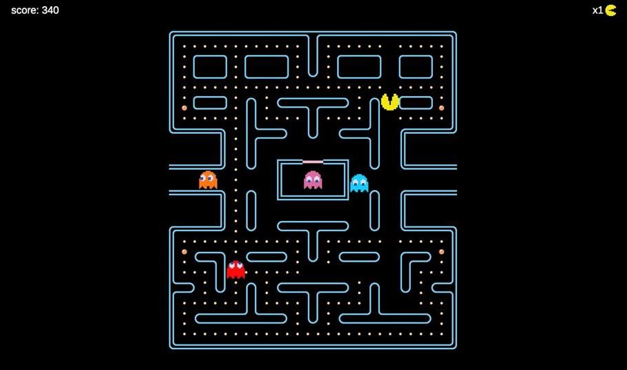

## About Pacman
Pac-Man, originally called Puck Man in Japan, is a 1980 maze action video game developed and released by Namco for arcades. In North America, the game was released by Midway Manufacturing as part of its licensing agreement with Namco America. The player controls Pac-Man, who must eat all the dots inside an enclosed maze while avoiding four colored ghosts. Eating large flashing dots called "Power Pellets" causes the ghosts to temporarily turn blue, allowing Pac-Man to eat them for bonus points.

So I wanted to dive into development and try to repeat the game

## Installation
Download the "PacmanGame" folder and open the .exe file. ( for Windows )

"Assets" - Developer folder in Unity

"PacmanGame" - Game folder

## Control:

#### W/Up - UP | S/Down - Down | A/Left - LEFT | D/Right - RIGHT

## Support

#### Mark Seliverstov | Mail: smdmrr00@gmail.com 

## Project status
Now the basis of the project is ready. You can add your own levels, maps, additional logic, and so on. There is something to develop.
#### Last reliase 0.0.2 ( 24.07.2022 )
